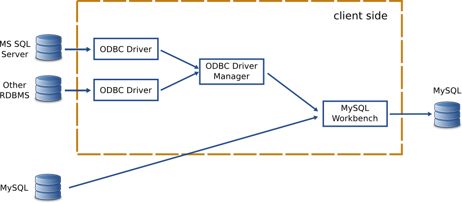

Connecting to MS SQL Server Databases from Linux
####################################################

The MySQL Workbench Migration Tool uses ODBC to communicate to RDBMSes other than MySQL.
To be able to migrate a database from a given RDBMS you need to setup all the pieces that
will make this ODBC connection work.

The following image shows the general components involved in an ODBC connection:

For each RDBMS you need its corresponding ODBC driver. This driver is usually provided
by the RDBMS manufacturer. Above all these specific ODBC drivers there is the ODBC
Driver Manager. It ensures that the proper driver is loaded when you specify the
connection datasource among other things (more on this later). Both the ODBC driver and
the ODBC driver manager must be installed in the same PC where Workbench is running.

.. note::
    Since the ODBC driver needs to be installed in the client side you will need an
    ODBC driver that supports your client OS and architecture. So if you are running
    Workbench from Linux x64 you need a Linux x64 ODBC driver for your RDBMS. Check
    the availability of a suitable ODBC driver.

The rest of this document explains how to set up these components so that you can
migrate Microsoft SQL Server databases into MySQL using the Linux version of MySQL
Workbench.

Installing the Driver Manager
******************************

There are two popular open source ODBC driver managers: `unixODBC <http://www.unixodbc.org>`_
and `iODBC <http://www.iodbc.org>`_. The most commonly used in Linux is unixODBC.

Modern Linux distributions provide a convenient package with unixODBC. If you are using
Ubuntu you can install this package using the following command: ::

    sudo apt-get install unixodbc

.. warning::
    Some ODBC drivers require a recent version of unixODBC. Make sure you have the right
    unixODBC version installed and if you don't install a suitable version from its source
    distribution.

Installing the ODBC Driver for your RDBMS
*******************************************

`Until very recently <http://blogs.msdn.com/b/brian_swan/archive/2011/10/13/microsoft-announces-sql-server-odbc-driver-for-linux.aspx>`_
Microsoft only provided Windows versions of their ODBC drivers for SQL Server. Third party
drivers for SQL Server were available long before their release of the Linux version.
Nowadays you should use the native `Microsoft SQL Server ODBC Driver for Linux <http://msdn.microsoft.com/en-us/library/hh568451.aspx>`_
whenever possible. Unfortunately the current version of Microsoft's drivers only supports x64
architectures so you are out of luck if you are running Workbench in a 32 bits Linux distro.

There's one more inconvenience with the native SQL Server ODBC driver for Linux: they are
designed to be run in RedHat Enterprise Linux (RHEL) and its derivatives. If you are using
other disto you would have to make it work for it. If you use Ubuntu, `this guide <http://www.codesynthesis.com/~boris/blog/2011/12/02/microsoft-sql-server-odbc-driver-linux/>`_
will help you to get through it. Once installed verify that you can successfully connect to
SQL Server `as explained here <http://msdn.microsoft.com/en-us/library/hh568447.aspx>`_.

In case you can't use the native ODBC driver you'd need to install a third party one. A popular
choice is `FreeTDS <http://www.freetds.org>`_. Most likely your distribution will make it
available in their software repository. In Ubuntu the ``tdsodbc`` package is provided. There's
a section in the FreeTDS documentation that addresses `common problems that you might encounter
<http://www.freetds.org/userguide/troubleshooting.htm>`_. Once you have installed FreeTDS check
that you can properly connect to your SQL Server with the provided ``tsql`` client as explained
`here <http://www.freetds.org/userguide/serverthere.htm#SERVERTHERE.TSQL>`_.

.. warning::
    You should make sure that you have a recent version of FreeTDS. We have had some problems with
    older versions so **we recommend FreeTDS v0.91 or newer**.

Registering your ODBC driver with unixODBC
********************************************

Before using an ODBC driver you should register it with unixODBC. This is done in a configuration
file usually found in ``/etc/odbcinst.ini``. You can either manually edit this file `as explained
here <http://www.unixodbc.org/odbcinst.html>`_ or you can use a GUI editor like ODBCConfig (in the
``unixodbc-bin`` package in Ubuntu). For each driver you have to put a name for it (when connecting
to your server you would refer to its ODBC driver using this name) and to set up the location of
the driver libraries in your system. Chances are that if you installed the ODBC driver from your
distro's repository its corresponding settings were added to the configuration file by the
installer script for your convenience. If you have to do it yourself, check your ODBC driver
documentation for instructions on how to fill these values.

Connecting to the RDBMS
****************************

Now that your ODBC driver is properly registered with unixODBC you can proceed to connect to its
RDBMS. You would tipically need for this some parameters such as the server IP address or hostname,
the server port, the driver to use for the connection, the database, the authentication credentials
(usually a username and a password), etc. To facilitate this unixODBC allows you to store this
parameters as a named connection so that you don't have to provide them every time you try to connect
to your database. This named connections are called *datasources* in the ODBC jargon and are defined
in a file named ``odbc.ini`` (you can define system wide datasources by putting this file in ``/etc``
or user wide ones if the ``odbc.ini`` file is inside a user's home dir). The format of this
file and the allowed parameters in datasource definitions `can be found here <http://www.unixodbc.org/odbcinst.html>`_.
As in the case of the ``odbcinst.ini`` file there are GUI editors to make your life easier (the 
aforementioned ODBCConfig program can deal with both ``odbcinst.ini`` and ``odbc.ini`` files).
