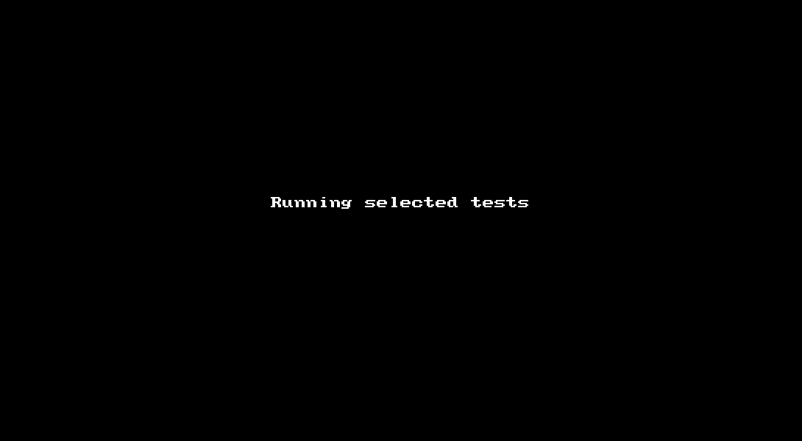

# Casmine - C++ BDD Testing Framework

## Description


Casmine is a C++ unit and integration testing framework written in C++17 that enables testing C and C++ code with matchers, similar to the way [Jasmine](https://jasmine.github.io/) does for Javascript (hence the similar name). Care has been taken to make the framework very flexible but still easy to write tests and later read them with ease. The framework runs on any platform with a C++17 compiler.

Casmine hides most of the boilerplate code necessary to run the tests and comes with a set of elements that help to structure your test code in a way that is easily consumable by humans. Tests are organized in spec files (one test case per file) and are self registering. After you add such a spec file to your testing project it will automatically execute on run. Two main elements structure a spec file: `$describe` and `$it`. The first covers an entire test case and consists of zero or more `$it` blocks, which will be executed in definition order (`$describe` execution is random, because of static initialization). In addition to that, you can specify blocks that are executed before and after all tests, or before/after each test - good for setup and shutdown of test (groups).

Each test case and test can be individually disabled or focused on (which disables all non-focused tests). Focused tests in disabled test cases are still disabled, however. Additionally, a test can be marked as pending, which causes Casmine to ignore any result from it and produces a record in the test output that allows you to identify it easily. This helps greatly to start with spec skeletons and fill them later without missing one test or to specifying a reason why a test is not executed *now* (what `$xit` does not allow).

## Main features

- Written in C++17.
- Type safe tests with type specific matchers.
- Comprehensive collection of matchers and expects that should cover most of your needs.
- Very simple, yet powerful and flexible test spec structure, using only `$describe` and `$it`.
- Run test management code by using `$beforeAll`, `$afterAll`, `$beforeEach` and `$afterEach`.
- Focus on specific tests or entire test cases by using `$fit` and `$fdescribe`.
- Exclude specific tests or entire test cases by using `$xit` and `$xdescribe`.
- Mark tests explicitly as succeeded or failed by using `$success()` and `$fail()`.
- Mark tests as pending by using `$pending()`.
- Built-in console reporter with colored output.
- Built-in JSON reporter, which generates a JSON result file for easy integration with any CI system.
- Easily extend the matchers and the expects, in case your objects don't fit the stock classes.

**Casmine in action:**



## Getting Started

In its simplest form a test spec file looks like this:

```c++
#include "casmine.h"

using namespace casmine;

namespace {

$ModuleEnvironment() {};

$describe("Test Case Description") {
  $it("Test Description", []() {
    $expect(1).toBe(1);
  });
});

}
```

The `$ModuleEnvironment` macro ensures the necessary structures are in place for the spec file, which are then used by the `$describe` and `$it` blocks. Since this implements the same class in each spec file it is necessary to wrap the entire test spec with an anonymous namespace, to avoid linker problems. On the other hand, this macro enables you to easily extend Casmine for your own project structure (more about that below).

Macros are used to record file name + line number of the executing code block. This is also important for possible (unexpected) exceptions, which otherwise would not have any source location attached.

The `$it` block takes a `std::function` for execution, which consists of `$expect` calls that do the actual test steps (checks). Each `$expect` call creates a temporary expectation object, runs the associated matcher (here `toBe`) and records the result. After that the expectation object is freed.

Typically a test case also consists of setup and shutdown code, which could be like this:

```c++
$describe("Test Case Description") {
  $beforeAll([]() {
    myServer.start();
  });
  
  $afterAll([]() {
    myServer.stop();
  });
  
  $beforeEach([]() {
    myServer.reset();
  });
  
  $afterEach([]() {
    // Remove temporary data.
  });
  
  $it("Test Description)", []() {
    $expect(1).toBe(1);
  });
});
```

To run the test suite, call the Casmine context, which manages everything, in your main.cpp file:

```c++
#include "casmine.h"

using namespace casmine;

int main(int argc, const char *argv[]) {
  auto context = CasmineContext::get();
  
#ifdef _MSC_VER
  SetConsoleOutputCP(CP_UTF8);
#endif

  context->runTests(/* specify the base path here */);

  return 0;
}
```

The `runTests` path parameter is used to locate data and output directories. Additionally, all file names reported in the results are made relative to this path. Use `CasmineContext::basePath()` to get this path in your spec files. Casmine expects a data folder in the base directory (`<base>/data`) and will copy its entire content to a temp data dir before running any test. The member `Casmine::tmpDataDir()` can be used to get the name for that folder, when you want to access your data. Because this is a copy of the original data, it's allowed to be modified, without affecting the original data.

Casmine creates an output folder during the test execution, which you can use to store any output your tests might produces. The actual path to that can be read from `Casmine::outputDir()`.

The temporary data dir as well as the output dir are removed when Casmine finishes (and also on start up, when they were left over from a previous run, which would indicate a crash of the application).

## Overview

A test step (which is part of an `$it` block) has a pretty simple form:

    $expect(<actual value>).[Not.]toXXX(<expected value>, <optional message>);
    
`$expect` is a macro that records line number and file name where it is called from and then calls one of the factory functions (depending on the type of `<actual value>`), which instantiates the associated Expect classes, executes the check, records the result and frees the `Expect` instance. The `toXXX` call usually performs a relational operation, but can in special cases also do more complex processing (like matching a regular expression or compare to file content). The member `Not` inverts the expectation. Results are not stored in Casmine, but only sent to the registered reporters. These can then just count success + failure or do something else with the results.

All calls to record results are synchronized (and hence thread-safe), to avoid logging results to the wrong test spec or test. Other access is not guarded because that's either read-only or using temporary objects.

Casmine catches every exception that might occur in the test code, be it wanted or unexpected. Exceptions are logged with the line info and file name of the last successful call to either `$describe`, `$it` or `$expect`, whichever was called last. Additionally, you can do checks for exceptions by placing the code that throws them in a `std::function` and use that in an `$expect` call. By default test execution is stopped if an unexpected exception occurs, however this can be changed by the setting `continueOnException` (see also the Configuration section).

It is not necessary that `$expect` calls are written in the same file where their surrounding `$describe` or `$it` block is located. Casmine is a stateful implementation that records test results from anywhere to the currently executing test. This enables sharing of test code between tests, by moving it out to a separate file, and then calling that in different places.

**Important**: while you can write normal code in a `$describe` block, outside of any `$it`, `$beforeAll` etc. call, you must not access anything of that in these calls (via capture by reference), because the outer `$describe` block is executed during registration and variables in it are no longer available when the inner blocks are later executed. Code like the following will crash:

```c++
$describe("Test Case Description") {
  size_t count = 42;
  
  $it("Test Description", [&]() {
    // Crash here because this closure is executed outside of the outer block.
    $expect(count).toBe(42); 
  });
});

```

See the "Test Data" section below for details how you can hold test values etc. for use in tests.

**Note**: it is not necessary for either the actual or expected value to be copy-assignable. Internally, all provided values are held as const references, making it possible to check also non-copyable objects like `unique_ptr`. However, for strings, sometimes a copy is necessary to allow a comparison of different string types (`string` against `char*` and `char[]` etc.). It's clear that both actual and expected values must stay valid during a call to `$expect`.

Casmine comes with a number of predefined Expect classes, which are automatically selected via type deduction and provide a number of matcher functions, specific to the deduced type. The framework contains Expect classes for:

- **Scalars** (integral types, pointers (except string pointers) and object references)
- **Strings** (`basic_string`, as well as `char`, `wchar_t`, `char16_t` and `char32_t` pointers and arrays)
- **Classes** (all classes/objects, except standard containers, exceptions and strings as they have specialized matchers)
- **Exceptions** (exceptions thrown in a `std::function`)
- **Containers** (`array`, `vector`, `deque`, `forward_list`, `list`, `set`, `multiset` and their unordered variants)
- **Associative Containers** (`map`, `multi_map` and their unordered variants)
- **Smart Pointers** (`unique_ptr`, `shared_ptr`, `weak_ptr`)

Each of the Expect classes is derived from one or more of the following predefined matchers, which provide the type-dependent match functions:

- **`MatcherScalar`** (used by the scalar and pointer Expects)
  - **`toBe`** (value equality)
  - **`toEqual`** (value equality or object identity for classes that override the `==` operator)
  - **`toBeLessThan`** (< comparison, also for classes overriding that operator)
  - **`toBeLessThanOrEqual`** (<= comparison)
  - **`toBeGreaterThan`** (> comparison)
  - **`toBeGreaterThanOrEqual`** (>= comparison)
  - **`toBeTrue`** (actual value cast to boolean)
  - **`toBeFalse`** (actual value cast to boolean)
  - **`toBeCloseTo`** (numeric value with a maximum distance to a given value)
  - **`toBeOddNumber`** (for integral types, see [`std::is_integral`](https://en.cppreference.com/w/cpp/types/is_integral))
  - **`toBeEvenNumber`** (for integral types)
  - **`toBeWholeNumber`** (for arithmetic types, see [`std::is_arithmetic`](https://en.cppreference.com/w/cpp/types/is_arithmetic))
  - **`toBeWithinRange`** (numeric value within a range)
  - **`toBeInf`** (infinitive number)
  - **`toBeNan`** (not a number)
- **`MatcherString`** (used by the string Expect)
  - **`toBe`** (alias to `toEqual`)
  - **`toEqual`** (string equality using [`std::basic_string::compare`](https://en.cppreference.com/w/cpp/string/basic_string/compare))
  - **`toBeLessThan`** (< string comparison using the string compare function)
  - **`toBeLessThanOrEqual`** (<= string comparison)
  - **`toBeGreaterThan`** (> string comparison)
  - **`toBeGreaterThanOrEqual`** (>= string comparison)
  - **`toContain`** (find text in the actual value)
  - **`toStartWith`** (test that the actual value begins with a string)
  - **`toEndWith`** (test that the actual value ends with a string)
  - **`toContainOnlyWhitespaces`** (only tab, vertical tab, space, CR/LF and form feed)
  - **`toContainNoWhitespaces`** (all but the aforementioned whitespaces)
  - **`toBeSameLengthAs`** (actual value length == expected value length)
  - **`toBeLongerThan`** (actual value length > expected value length)
  - **`toBeShorterThan`** (actual value length < expected value length)
  - **`toMatch`** (actual value matches regular expression, given either as string or regex)
  - **`toEqualContentOfFile`** (loads a text file and compares it line-by-line to the test value)
- **`MatcherTypeSupport`** (used by class and pointer Expects)
  - **`toBeInstanceOf`** (object is an instance of a specific class)
  - **`toBeSameType`** (class type derivation check)
- **`MatcherException`** (used by exception Expect)
  - **`toThrow`** (function throws any exception)
  - **`toThrowError`** (function throws a specific exception)
- **`MatcherContainer`** (used by container Expect)
  - **`toContain`** (actual value contains a specific element)
  - **`toContainValues`** (actual value contains a list of values with no implied order)
  - **`toHaveSize`** (actual value size)
  - **`toEqual`** (actual value content comparison via `==` operator)
- **`MatcherAssociativeContainer`** (used by associative container Expect)
  - **`toContainKey`** (key search)
  - **`toContainValue`** (value lookup for a given key)
  - **`toHaveSize`** (container size)
  - **`toEqual`** (content comparison via `==` operator)
- **`MatcherNull`** (used by pointer and smart pointer Expects)
  - **`toBeNull`** (equals `nullptr`)
  - **`toBeValid`** (non-null value for smart pointers or `nullptr` equality)
- **`MatcherClass`** (used by class Expect)
  - **`toEqual`** (object identity via `==` operator)
  - **`toBeLessThan`** (< comparison)
  - **`toBeLessThanOrEqual`** (<= comparison)
  - **`toBeGreaterThan`** (> comparison)
  - **`toBeGreaterThanOrEqual`** (>= comparion)
  
Matcher functions generate nice human readable output in case of test failures, including source location information. The failure message can be overridden by specifying a custom message in the matcher function, for example:

    $expect(1).toBe(1, "Surprising result");

To invert a test check, use the `Not` member of the Expect class:

    $expect(1).Not.toBe(1, "Less surprising");

## Test Data

Most of the time, when you run tests, you probably need some data to test on or to share between tests. Casmine supports that with a separate macro, named `$TestData`. This is actually a simple `struct` that can hold whatever you need. A typical use case looks like this:

```c++
#include "casmine.h"

using namespace casmine;

namespace {

$ModuleEnvironment() {};

$TestData {
  std::string testValue = "ABC";
};

$describe("Test Case Description") {
  $it("Test Description", [this]() {
    $expect(data->testValue).toBe("ABC");
  });

  $it("Test Description 2", [this]() {
    $expect(data->testValue).Not.toBe("XYZ");
  });
});

}
```

As you can see, this struct is made available as member `data` in the object behind `$describe`. As such, you can access all values via `data->member`, provided you capture the `this` pointer in the `$it` call. The `data` member is not available and produces a compiler error if there's no definition of the `$TestData` struct.

The `$TestData` macro can be placed anywhere in the file provided it appears before the `$describe` call (where a member of this type is declared, as explained above).

## Configuration

Casmine provides two types of configurations: settings to control the execution of itself and configuration values that are used by the tests.

### Settings

The following settings are used by Casmine:

  - **`continueOnException`** (**bool**, default: **false**) see below
  - **`verbose`** (**bool**, default: **false**) free to use in your tests, for example for debug messages
  - **`no-colors`** (**bool**, default: **false**) do not use terminal colors in the console reporter
  - **`only-selected`** (**bool**, default: **false**) see below

Even though all unexpected exceptions are caught during a test run (to ensure proper shutdown), Casmine will still stop execution if one occurred, unless the value `continueOnException` is set to true. This does not apply to exceptions checks in your test code, of course, which are _expected exceptions_. It's also guaranteed that `$afterAll` and `$afterEach` are called if an unexpected exception came up during the run of a test spec.

Normally test specs run in random order and according to their type (normal, focused, disabled). If you want to change the type, you have to recompile your tests. Sometimes it might be necessary to run specs in a certain order (for example while working on a specific spec) or when switching between specs frequently. In this case you can enable the `only-selected` setting and call `CasmineContext::forceSpecList()` with a list of spec file names (no path, no extension). This could be implemented as application parameter, taking the user input and forwarding that to this function. For a list of registered specs call `CasmineContext::getSpecList()`.

Casmine settings are available in the `CasmineContext::settings` member, which contains key/value pairs of the form:

```c++
typedef std::variant<std::string, int, double, bool> ConfigMapVariableTypes;
std::map<std::string, ConfigMapVariableTypes> settings;
```

This member is flexible enough to introduce further settings in the future.

### JSON Configuration

For test configuration you sometimes need sensitive data (like passwords). Passing them on the command line or in the test code is not recommended and unsave. Instead Casmine comes with a JSON document member (provided by [rapidJSON](http://rapidjson.org/)) that can be loaded from an external JSON file. A typical approach is to allow the user to specify the path to such a config file as application parameter and then load it directly into Casmine, like this:

```c++
  auto context = CasmineContext::get();
  std::ifstream configStream;
  configFile = expandPath(configFile);
  
  if (!configFile.empty())
    configStream.open(configFile);
  if (configStream.good()) {
    rapidjson::IStreamWrapper streamWrapper(configStream);

    rapidjson::ParseResult parseResult = context->configuration.ParseStream(streamWrapper);
    if (parseResult.IsError()) {
      const RAPIDJSON_ERROR_CHARTYPE *message = GetParseError_En(parseResult.Code());
      std::cerr << "Error while parsing the configuration file: " << message << std::endl;
      return 1;
    }

    if (!context->configuration.IsObject()) {
      std::cerr << "The configuration file has not the correct format" << std::endl;
      return 1;
    }
  } else {
    std::cerr << "Error while opening the configuration file " << configFile << ": " << strerror(errno) << std::endl;
    return 1;
  }
```

Casmine supports easy access to this config data via `CasmineContext::configuration`. Additionally, you can use helper functions to get values from a specific path through the JSON file (nothing fancy like XPath, just a simple recursive name lookup, which limits this to named elements, such as, no array elements). The names of these helpers are pretty self explanatory:

```c++
  std::string getConfigurationStringValue(std::string const& path, std::string const& defaultValue = "") const;
  int getConfigurationIntValue(std::string const& path, int defaultValue = 0) const;
  double getConfigurationDoubleValue(std::string const& path, double defaultValue = 0.0) const;
  bool getConfigurationBoolValue(std::string const& path, bool defaultValue = false) const;
```

## Customizations

Casmine enables you to customize several aspects in a consistent way, without compromising the overall readability or handling.

### Reporters

There are 2 predefined reporters currently:

- Terminal/Console with color support (where possible + meaningful, that means no ugly codes in log files)
- JSON result file (for easy consumption by CI and other automated systems)

Color support is automatically determined (but can also be switched off by assigning `true` to the settings value `no-colors` or setting the environment variable `CASMINE_NO_COLORS=1`).

It's easy to add own reporters (for example to log results in a database) by deriving from the abstract `Reporter` class and implementing the necessary functions that do the specific handling. The new reporter must be registered via `CasmineContext::addReporter`. Registered reporters can be removed using `CasmineContext::clearReporters`.

### Expects and Matchers

Casmine already covers a large part of possible test types, but sometimes it is necessary to expand on that for specific handling, for example to provide own matcher functions for either already covered cases or your own custom types. The main anchor point for extensions is the already mentioned `$ModuleEnvrionment` macro. It consists of two parts:

  1. Local extensions
  2. Library extensions

Local extensions are valid only in the file where you specify them, while library extensions are reusable by all test specs. The technique behind this extension mechanism works with variadic base types, which is a variation of [parameter packs](https://en.cppreference.com/w/cpp/language/parameter_pack) (see the paragraph titled **Base specifiers and member initializer lists**). In short: the factory struct for the Expect class creation functions is composed of three parts:

  1. A struct with all default factory functions (named `DefaultExpects`).
  2. A struct in the local file (the `{ }` block of the `$ModuleEnvironment` macro).
  3. A list of custom structs which can be implemented outside the current spec file. The names of these structs must be specified in the parentheses of the `$ModuleEnvironment` macro).

A full environment call can be similar to this:
  
```c++
#include "casmine.h"

using namespace casmine;

namespace {

$ModuleEnvironment(MyExpects1, MyExpects2) {
  static auto makeExpect(const char *file, size_t line, MyType const& value) {
    return ExpectTemplate<MyExpect1<MyType>>(file, line, value);
  }
};

...

}
```

The two library extensions (`MyExpects1` and `MyExpects2`), as well as the code in the environment block are all combined together with the default expects into a single local environment struct and take part in type deduction for your custom types automatically.

The implementation of a custom expect class now offers you the way to add standard matchers or own matcher functions by defining it (for example) as:

```c++
template<typename T>
class MyExpect1 : public Expect<T>, public MatcherClass<T>, public MySuperMatcher<T> {
public:
MyExpect1(const char *file, size_t line, T const& value, bool inverse) :
  MatcherBase<T>(file, line, value, inverse),
  Expect<T>(),
  MatcherClass<T>(file, line, value, inverse),
  MySuperMatcher<T>(file, line, value, inverse) {}
};
```
A custom Expect class always has to derive from 2 classes: `Expect` which is the base for all Expect classes and `MatcherBase` which is the base for all Matcher classes. Due to the virtual inheritance used for the matchers, it is necessary to explicitly call the `MatcherBase` constructor, even if the sub Expect class does not directly derive from it.

In addition to these 2 base classes you can derive from any number of your own (or built-in) matcher classes. Each of them can provide a specific set of possible matcher functions. Take a closer look at the built-in matchers to learn how to write such a class.

**In summary:** the actual testing functionality is provided by the matcher classes, while the expect classes are used to select those matchers that provide the correct functionality for a given C/C++ type and provide the environment to easily execute normal and inverted expectations.

To supplement the previous description of Casmine, see the following concrete example for a custom class:

```c++
// The class to test (implementation omitted for brevity).
class FtpClass {
public:
  void connect();
  void disconnect();
  bool isConnected();
  std::string toString();
}

// The matcher providing specific check functions for this custom class.
template<typename T = FtpClass>
class MatcherFtp : MatcherBase<T> {
public:
  MatcherFtp(const char *file, size_t line, T const& actual, bool inverse) :
    MatcherBase<T>(file, line, actual, inverse) {}
    
  using MatcherBase<T>::actualValue;
  using MatcherBase<T>::invertComparison;
  using MatcherBase<T>::processResult;
  
  void toBeConnected() {
    bool result = actualValue.isConnected();
    if (inverComparison)
      result != result;
    processResult(result, invertComparison ? "The connection should be closed" : "The connection should be open");
  }
}

// The wrapping Expect class for the FTP matcher.
template <typename T>
class ExpectFtp : public Expect<T>, public MatcherFtp<T> {
public:
  ExpectFtp(const char *file, size_t line, T const& value, bool inverse) :
    MatcherBase<T>(file, line, value, inverse),
    Expect<T>(),
    MatcherFtp<T>(file, line, value, inverse) {}
};

$ModuleEnvironment() { 
  // This factory method takes part in the type deduction process to find an Expect class
  // for a specific custom type.
  static auto makeExpect(const char *file, size_t line, const FtpClass &value) {
    return ExpectTemplate<ExpectFtp>(file, line, value);
  }
};

FtpClass ftp;

$describe("Test FTP") {
  $beforeAll([]() {
    ftp.connect();
  });
  
  $it("Test Description)", []() {
    $expect(ftp).toBeConnected();
  });
});
```

## Library Functions

In addition to the main functionality for tests, there are some helper functions/structs to ease certain tasks. They are all used in Casmine, but are available also for general use in your tests or custom matchers.

### ANSI Styles

If you want to print custom messages in your tests or reporters that are colored and/or have a certain style (bold, italic etc.), then you can use the output stream operators in the file `ansi-styles.h`. Here's an example:

    std::cout << styleGreenBackgroundOn << styleItalicOn;
    std::cout << "Some italic text on a green background";
    std::cout << stylesReset << std::endl;
    
These operators will automatically take care to print nothing if the current output pipe is not a terminal (for example when redirected to a file).

### Type Deduction

Correct type deduction is a key aspect in Casmine to provide the right set of matching functions for a specific group of types. In the file `common.h` are helper templates for more concise factory functions, for example `EnableIf`, `EnableIfNot`, `IsContainer`, `IsSmartPointer` and others. Here's how the scalar Expect factory method uses some:

```c++
  template<
    typename T,
    typename = EnableIf<std::is_scalar<T>>,
    typename = EnableIfNot<std::is_pointer<T>>,
    typename = EnableIfNot<IsString<T>>
  >
  static auto makeExpect(const char *file, size_t line, T value, int *dummy = nullptr) {
    return ExpectTemplate<ExpectScalar<T>>(file, line, value);
  }
```
It is possible to freely mix the helper templates and the standard ones (as shown here for the pointer switch).

### Others

The header file `helpers.h` contains a number of other helper functions:

  - **`splitBySet`**: splits a string into components using the passed-in separators.
  - **`utf32ToUtf8`**: converts `std::u32string` to `std::string`.
  - **`utf16ToUtf8`**: converts `std::u16string` to `std::string`.
  - **`utf8ToUtf16`**: converts `std::string` to `std::u16string`.
  - **`randomString`**: generates a random string from ASCII characters + digits with a maximum length.
  - **`getEnvVar`**: safe variant to get an environment variable, returns the given default value if a variable doesn't exist.
  - **`expandPath`**: expands all environment variables and special chars (like the tilde on Linux/macOS) in the given string. Converts only those values that are valid on the current platform.
  - **`relativePath`**: returns the second path relative to the given base path, provided both have a common ancestor.
  - **`length`**: determines the length of a string literal at compile time (for instance for static assertions).
  - **`typeToString()`**: platform agnostic C++ type name demangling.
  - **`toString()`**: value-to-string conversion beyond the abilities of `std::to_string`. Output is always UTF-8encoded, also for UTF-16 and UTF-32 input.
  - **`containerToString`**: converts any container object (`set`, `map` etc.) into a string.
